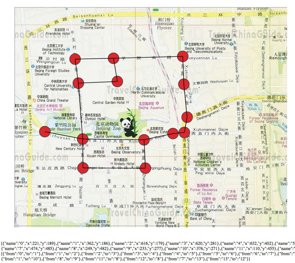

## Installation

- Download all files into a directory
- Optionally replace the map.png background image
- Open index.html in a modern browser

## Instructions

- click on the map to add a node (e.g. at road intersections)
- drag and drop a node to reposition it
- right click on one node and then on another node to connect them
- right click elsewhere on the map to cancel a connection in-progress (i.e before the second node has been right-clicked)

Once complete the bottom of the screen contains suitable input data (nodes and paths)
for input into a shortest path algorithm.

